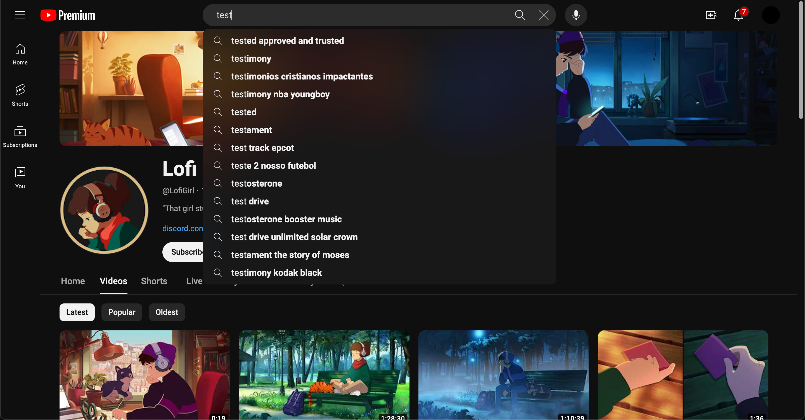
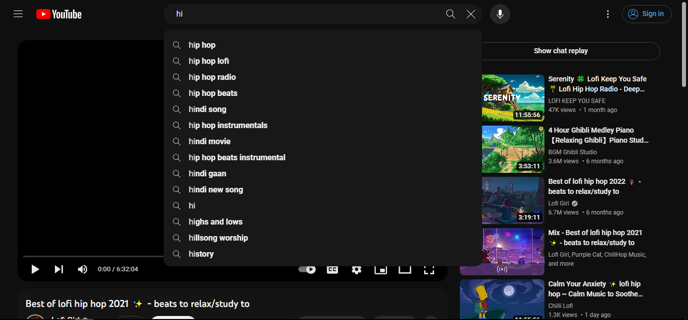

# YouTube Modern Theme

### If you want to use the latest version, please add/replace update URL to the dev branch in your UserCSS.

I'm using this every day, so I'll keep updating it.

[Installation](#installation) | [Screenshots](#screenshots)

## Installation

1. Install [Stylus](https://add0n.com/stylus.html) extension for your browser.
2. Import the theme from [userstyles.org](https://userstyles.world/style/6049/youtube-modern-dark).

# Screenshots

 Just using MrBeast as an example.

